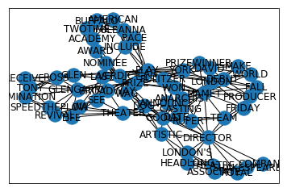
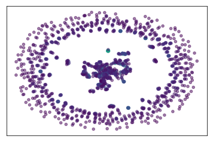

# Multi-centrality index

## How to use it and examples 

This is a notebook showing how to use the code of the proposed method for Multi-Centrality Index, which was employed for the analysis of keywords in [1]. The code is in Python3, and some toolboxes are necessary to run the commands. 

The following very common packages are necessary for running the code:

* numpy
* pandas
* networkx
* sklearn

``` python
import numpy as np
import pandas as pd
import networkx as nx
from sklearn.decomposition import PCA
from sklearn.preprocessing import StandardScaler, MinMaxScaler
```

Then, you can run the example from a preloaded matrix of features (centralities) of a previous constructed graph-of-words (network) with the co-occurrence approach. 

Each word of the graph is sorted by the corresponding Multi-centrality Index (**MCI**) value. 
In this example, the MCI is the combination of these centrality measures: [*'Degree','Pagerank','Eigenvector','StructuralHoles'*]

Top words are considered the keywords of the text.

You run the code as follow:

```python
python MultiCentralityIndex.py
```

               Word       MCI
    0         MAMET  1.501088
    1          PLAY  1.484412
    2      DIRECTOR  0.968968
    3     ANARCHIST  0.887786
    4       THEATER  0.712872
    5      PULITZER  0.647991
    6        LONDON  0.635058
    7         GOOLD  0.619282
    8          YEAR  0.605723
    9     GLENGARRY  0.572361
    10        DEBUT  0.530749
    11        DAVID  0.311259
    12         YORK  0.225655
    13  PRIZEWINNER  0.215347
    14        PRIZE  0.208866
     ... 

```python
import MultiCentralityIndex as mc
mc.test()
```



    


Besides, you can import and use the code as your necessity. For example, lets calculate the MCI for the <a href='http://www-personal.umich.edu/~mejn/centrality/' target='_blank'>Coauthorships in network science</a> <table><tr><td><span><b> A figure depicting the largest component of this network</b></span> Extracted from Prof. Newman <a href='http://www-personal.umich.edu/~mejn/netdata' target='_blank'> Web site</a></td><td></td></tr></table>


``` python
import MultiCentralityIndex as MCI
import networkx as nx

# Creating the MCI object
mc = MCI.MCI()

#loading the netscience graph
G = nx.read_gml('netscience.gml',label='label')
node_size=[float(G.degree(v)) for v in G]

#Showing the graph of the full network
nx.draw_networkx(G, arrows=True, node_size=20, node_color=node_size,edge_color='grey',alpha=.5,with_labels=False)
```



    


Now, let's define the set of centrality measures to be calculated as
``` python 
setCentralities = ['Degree','Pagerank','Eigenvector','StructuralHoles','Closeness', 'Betweenness']
```
In this example we are calculating the MCI for a single graph (network). For this, we just call the ```getMCI_PCA``` method. 


```python
mc.getMCI_PCA(G,setCetralities=setCentralities)[:10]
```

<table border="1" class="dataframe">
  <thead>
    <tr style="text-align: right;">
      <th></th>
      <th>Word</th>
      <th>MCI</th>
    </tr>
  </thead>
  <tbody>
    <tr>
      <th>0</th>
      <td>NEWMAN, M</td>
      <td>1.550027</td>
    </tr>
    <tr>
      <th>1</th>
      <td>BARABASI, A</td>
      <td>1.330304</td>
    </tr>
    <tr>
      <th>2</th>
      <td>JEONG, H</td>
      <td>1.221634</td>
    </tr>
    <tr>
      <th>3</th>
      <td>PASTORSATORRAS, R</td>
      <td>1.043823</td>
    </tr>
    <tr>
      <th>4</th>
      <td>SOLE, R</td>
      <td>1.040874</td>
    </tr>
    <tr>
      <th>5</th>
      <td>BOCCALETTI, S</td>
      <td>0.978564</td>
    </tr>
    <tr>
      <th>6</th>
      <td>MORENO, Y</td>
      <td>0.903129</td>
    </tr>
    <tr>
      <th>7</th>
      <td>HOLME, P</td>
      <td>0.871221</td>
    </tr>
    <tr>
      <th>8</th>
      <td>CALDARELLI, G</td>
      <td>0.808137</td>
    </tr>
    <tr>
      <th>9</th>
      <td>VESPIGNANI, A</td>
      <td>0.807601</td>
    </tr>
  </tbody>
</table>


**Note**: In the case of ref[1], we calculated the matrix of features from a collection or set of graphs-of-words of a repository and, then, we computed the first Principal Component (```getPC1``` method) from this matrix of features of the entire repository

Behind the scene, the ```getMCI_PCA``` is calling the ```getPC1FromGraph``` method, which obtains the matrix of centrality measures of the graph (``mtxDoc``) and calls the ```getPC1``` function for computing the first Principal Component (PC1) of the graph.

For illustration purpose, this is the matrix of features of the graph:

```python
mtxDoc = mc.getMatrixFeaturesGraph(G,setCentralities)
display(mtxDoc)
```

<table border="1" class="dataframe">
  <thead>
    <tr style="text-align: right;">
      <th></th>
      <th>Word</th>
      <th>Degree</th>
      <th>Pagerank</th>
      <th>Eigenvector</th>
      <th>StructuralHoles</th>
      <th>Closeness</th>
      <th>Betweenness</th>
    </tr>
  </thead>
  <tbody>
    <tr>
      <th>0</th>
      <td>ABRAMSON, G</td>
      <td>0.0588</td>
      <td>0.1398</td>
      <td>1.418e-15</td>
      <td>0.8871</td>
      <td>0.0231</td>
      <td>0.000000</td>
    </tr>
    <tr>
      <th>1</th>
      <td>KUPERMAN, M</td>
      <td>0.0882</td>
      <td>0.2209</td>
      <td>1.410e-15</td>
      <td>0.5085</td>
      <td>0.0309</td>
      <td>0.000071</td>
    </tr>
    <tr>
      <th>2</th>
      <td>ACEBRON, J</td>
      <td>0.1176</td>
      <td>0.1425</td>
      <td>1.394e-15</td>
      <td>0.6565</td>
      <td>0.0412</td>
      <td>0.000000</td>
    </tr>
    <tr>
      <th>3</th>
      <td>BONILLA, L</td>
      <td>0.1176</td>
      <td>0.1425</td>
      <td>1.396e-15</td>
      <td>0.6565</td>
      <td>0.0412</td>
      <td>0.000000</td>
    </tr>
    <tr>
      <th>4</th>
      <td>PEREZVICENTE, C</td>
      <td>0.1176</td>
      <td>0.1425</td>
      <td>1.419e-15</td>
      <td>0.6565</td>
      <td>0.0412</td>
      <td>0.000000</td>
    </tr>
    <tr>
      <th>...</th>
      <td>...</td>
      <td>...</td>
      <td>...</td>
      <td>...</td>
      <td>...</td>
      <td>...</td>
      <td>...</td>
    </tr>
    <tr>
      <th>1584</th>
      <td>MONDRAGON, R</td>
      <td>0.0294</td>
      <td>0.1425</td>
      <td>1.403e-15</td>
      <td>0.8805</td>
      <td>0.0103</td>
      <td>0.000000</td>
    </tr>
    <tr>
      <th>1585</th>
      <td>ZHU, H</td>
      <td>0.0588</td>
      <td>0.2196</td>
      <td>1.405e-15</td>
      <td>0.4027</td>
      <td>0.0206</td>
      <td>0.000035</td>
    </tr>
    <tr>
      <th>1586</th>
      <td>HUANG, Z</td>
      <td>0.0294</td>
      <td>0.1040</td>
      <td>1.407e-15</td>
      <td>0.8805</td>
      <td>0.0137</td>
      <td>0.000000</td>
    </tr>
    <tr>
      <th>1587</th>
      <td>ZHU, J</td>
      <td>0.0294</td>
      <td>0.1040</td>
      <td>1.409e-15</td>
      <td>0.8805</td>
      <td>0.0137</td>
      <td>0.000000</td>
    </tr>
    <tr>
      <th>1588</th>
      <td>ZIMMERMANN, M</td>
      <td>0.0588</td>
      <td>0.0731</td>
      <td>1.422e-15</td>
      <td>0.5524</td>
      <td>0.1381</td>
      <td>0.000000</td>
    </tr>
  </tbody>
</table>
<p>1589 rows × 7 columns</p>


And this is the first Principal Component (PC1) of the graph according to all columns (centralities) in the matrix of features


```python
PC1 = mc.getPC1(mtxDoc)
print(PC1)
```

         Degree  Pagerank  Eigenvector  StructuralHoles  Closeness  Betweenness
    0  0.535797  0.434088     0.202644        -0.494563   0.329897     0.360556


Or, you can filter selecting specific centralities


```python
PC1 = mc.getPC1(mtxDoc,setCentralities=['Degree', 'Pagerank', 'StructuralHoles'])
print(PC1)
```

         Degree  Pagerank  StructuralHoles
    0  0.621633  0.532563        -0.574412


Now, we can calculate the MCI of the graph considering the previous PC1 and calling the function 

``` python 
N = 10
centralNodes = mc.getMCI_PCA(G, PC1, N=N)
```

where N means the top N nodes. If **N = -1** it returns all the nodes.


```python
N = 10
MCI = mc.getMCI_PCA(G, PC1, N=N)
display(MCI)
```


<table border="1" class="dataframe">
  <thead>
    <tr style="text-align: right;">
      <th></th>
      <th>Word</th>
      <th>MCI</th>
    </tr>
  </thead>
  <tbody>
    <tr>
      <th>0</th>
      <td>BARABASI, A</td>
      <td>1.091113</td>
    </tr>
    <tr>
      <th>1</th>
      <td>NEWMAN, M</td>
      <td>1.026212</td>
    </tr>
    <tr>
      <th>2</th>
      <td>JEONG, H</td>
      <td>0.829966</td>
    </tr>
    <tr>
      <th>3</th>
      <td>YOUNG, M</td>
      <td>0.623524</td>
    </tr>
    <tr>
      <th>4</th>
      <td>OLTVAI, Z</td>
      <td>0.603774</td>
    </tr>
    <tr>
      <th>5</th>
      <td>BOCCALETTI, S</td>
      <td>0.601977</td>
    </tr>
    <tr>
      <th>6</th>
      <td>SOLE, R</td>
      <td>0.567841</td>
    </tr>
    <tr>
      <th>7</th>
      <td>KURTHS, J</td>
      <td>0.519397</td>
    </tr>
    <tr>
      <th>8</th>
      <td>ALON, U</td>
      <td>0.510426</td>
    </tr>
    <tr>
      <th>9</th>
      <td>PASTORSATORRAS, R</td>
      <td>0.492352</td>
    </tr>
  </tbody>
</table>
</div>


Clearly, the ranking changes depending on the selected centrality measures. 
This is why our proposal in Ref[1] of finding the best subset of centralities according to your supervised problem. For instance, applying some Feature Selection methods, correlation analysis, etc.

In unsupervised problems, a good approach could be to select the group of centrality measures less correlated.

# TextMiner:
## for KeyWords and KeyPhrase extraction

```TextMiner``` is a module that employs the MCI for extracting keywords and keyphrase from a single or collection of texts.
For using, you will need to have ```nltk``` and ```itertools``` packages installed:

``` python
os, re, string, nltk, en_core_web_sm, itertools, collections
```

Following, an example of use:


```python
import TextMiner as tm
import en_core_web_sm

Miner = tm.TextMiner(punctuations=None,min_length_sent=7, nlp=en_core_web_sm.load())
Miner.candi_pos = ['NOUN', 'PROPN', 'ADJ']  

# number of returned keywords and keyphrases
N = 10

# Loading three examples of stories written by Edgar Allan Poe
# content[0] is the "The Black Cat" story
from data.content import content

#Case 1. Considering a single text    
keywords = Miner.get_keywords_MCI_from_text(content[0],numberKeyWords=N)


print('CASE 1: \n\t Keywords\n')
print(keywords)  
print('\n \t Keysentences \n')

for sentence in Miner.get_ranked_phrases()[:N]:
    print('----------\n',sentence)

print('\n\t\t================ || =================\n')   

#Case 2. Considering a collection of texts
mtxDoc = Miner.get_mtxDoc_from_collection(content,
                                          setCentralities=['Degree', 
                                                        'Pagerank', 
                                                        'StructuralHoles'])

keywords = Miner.get_keywords_MCI_from_text(content[0],mtxDoc=mtxDoc,
                                            numberKeyWords=N)
print('CASE 2: \n \t Keywords\n')
print(keywords)  
print('\n \t Keysentences \n')

for sentence in Miner.get_ranked_phrases()[:N]:
    print('----------\n',sentence)
print('-------')

```

    CASE 1: 
    	 Keywords
    
           Word       MCI
    0      mere  1.933236
    1      half  1.337548
    2    horror  1.005507
    3       cat  0.979326
    4     other  0.973901
    5     beast  0.971519
    6      such  0.847697
    7    reason  0.845035
    8  terrible  0.844638
    9  humanity  0.833198
    
     	 Keysentences 
    
    ----------
     half of horror and half of triumph
    ----------
     which goes directly to the heart of him who has had frequent occasion to test the paltry friendship and gossamer fidelity of mere man
    ----------
     i indeed wretched beyond the wretchedness of mere humanity
    ----------
     mournful and terrible engine of horror and of crime
    ----------
     and many persons seemed to be examining a particular portion of it with very minute and eager attention
    ----------
     i experienced a sentiment half of horror
    ----------
     my next step was to look for the beast which had been the cause of so much wretchedness
    ----------
     and which constituted the sole visible difference between the strange beast and the one i had destroyed
    ----------
     this dread was not exactly a dread of physical evil
    ----------
     that the terror and horror with which the animal inspired me
    
    		================ || =================
    
    CASE 2: 
     	 Keywords
    
        Word       MCI
    0   mere  1.253141
    1   half  0.947709
    2  beast  0.819257
    3    cat  0.787077
    4  other  0.687237
    5   many  0.650715
    6   more  0.650715
    7  white  0.638784
    8   wall  0.626681
    9  sense  0.613148
    
     	 Keysentences 
    
    ----------
     half of horror and half of triumph
    ----------
     which goes directly to the heart of him who has had frequent occasion to test the paltry friendship and gossamer fidelity of mere man
    ----------
     i indeed wretched beyond the wretchedness of mere humanity
    ----------
     this dread was not exactly a dread of physical evil
    ----------
     i experienced a sentiment half of horror
    ----------
     there came back into my spirit a half
    ----------
     that the terror and horror with which the animal inspired me
    ----------
     and many persons seemed to be examining a particular portion of it with very minute and eager attention
    ----------
     for no other reason than because he knows he should not
    ----------
     and which for a long time my reason struggled to reject as fanciful
    -------


In CASE 1, the base of knowledge is extracted from the same text. The ```get_keywords_MCI_from_text``` implicitly construct the matrix of word features from ```content[0]```, which is used to extract the MCI keywords.

In CASE 2, the matrix of word features is constructed from the entire collection of text, by using the ```get_mtxDoc_from_collection``` method. Then, the matrix of word features (```mtxDoc```) is passed as parameter for finding the MCI keywords in ```content[0]```.

# References
You can use this code as it is for academic purpose. If you found it useful for your research, we appreciate your reference to our work _A multi-centrality index for graph-based keyword extraction_:

[1] Didier A. Vega-Oliveros, Pedro Spoljaric Gomes, Evangelos E. Milios, Lilian Berton. Information Processing & Management, V. 56, I. 6, November 2019, 102063. https://doi.org/10.1016/j.ipm.2019.102063


```python

```
